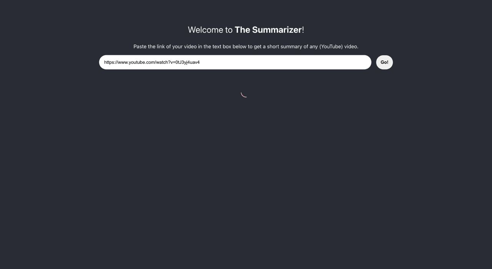
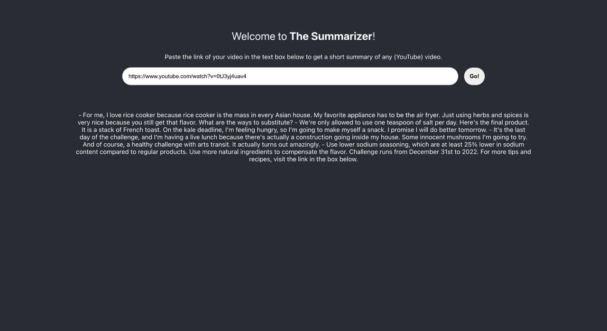
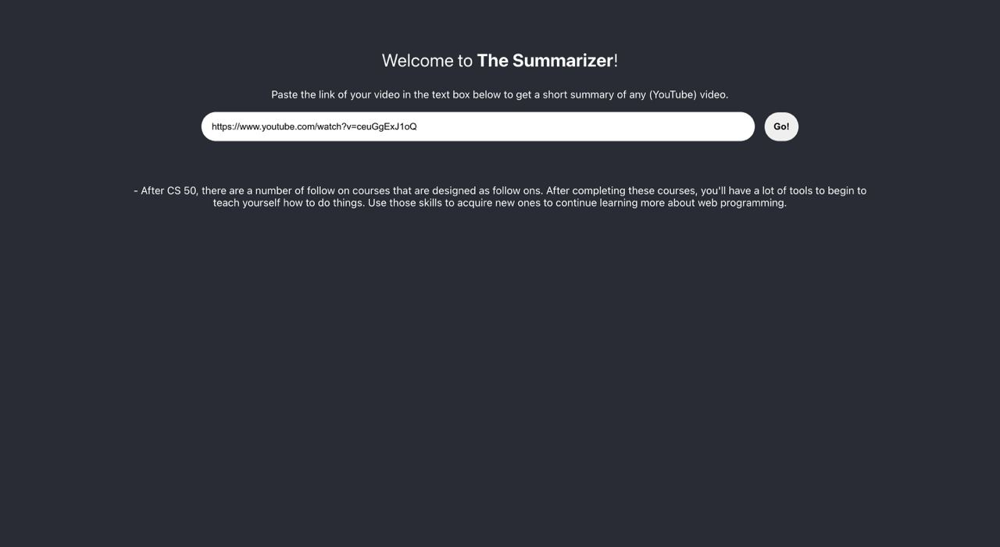
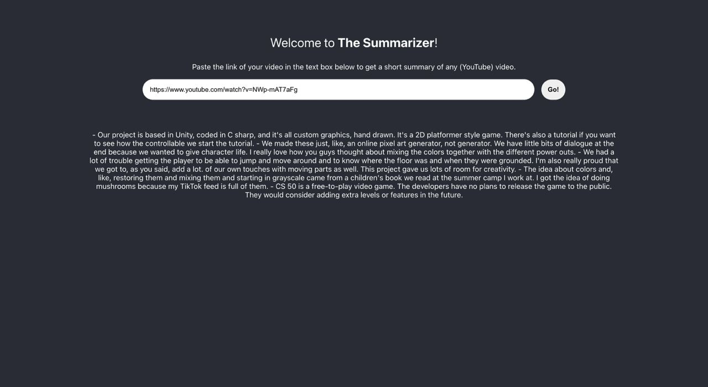

# The Summarizer

The Summarizer summarizes videos.

We use state-of-the-art machine learning models to first extract transcriptions of videos. Then, we summarize the transcription into its main ideas using a novel natural language processing unit.

